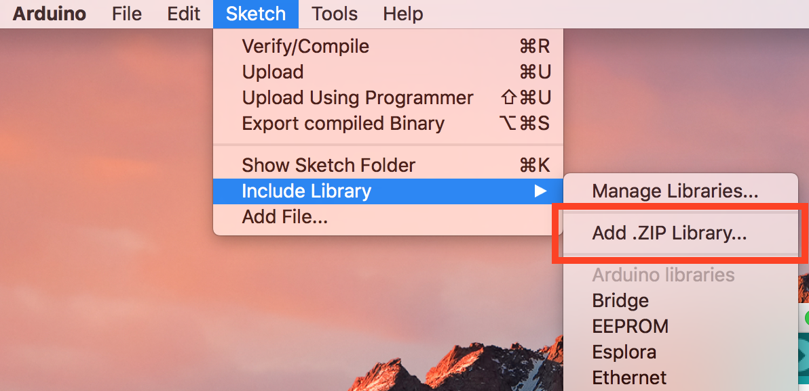

# iot-workshop
#Walkthrough for the Prototype like a Pro! Workshop

Before the workshop, there's a few things to prepare beforehand. Please go through these instructions and in case something doesn't work out, come talk to Wen or Pedro.

There's 4 things you'll need to do:
* Install the drivers to connect to the Wemos
* Install & configure the Arduino app
* Sign-up for the Blynk mobile app
* Test it!


## Step 1 — Install the drivers to connect to the Wemos (macOS only)

**WARNING: if you've used one of our Wemos before installing Sierra on your Mac and have the old CH340 drivers, connecting the Wemos to your USB port _will_ crash your Mac. Go to http://www.mblock.cc/posts/run-makeblock-ch340-ch341-on-mac-os-sierra and follow these instructions**

1. Download this [file](http://download.makeblock.com/mblock/CH34x_Install_V1.3.pkg) and run it. You'll need to restart your Mac after the installation is finished.

## Step 2 — Install & Configure the Arduino app

1. Go to [Arduino](http://arduino.cc/en/Main/Software) and download the Arduino IDE for your OS.

2. Run the installer & start the app

3. Go to *File* (or on Mac *Arduino*)* -> Preferences -> Additional Boards Manager* and paste the link below into it:

    `http://arduino.esp8266.com/stable/package_esp8266com_index.json`

4. Go to *Tools -> Board: "Arduino..." -> Board Managers* and Install *esp8266 by ESP8266 Community*

    
    
5. Download the [Blynk Arduino Library](https://github.com/blynkkk/blynk-library/archive/master.zip).

6. In the Arduino App, go to Sketch > Include Library > Add .ZIP Library 

7. Navigate to the Library you've just downloaded and add Choose it.

    _Once you have a Wemos and a Micro USB cable (come and get one!)_

5. From *Tools -> Board: "Arduino..." ->* select the *WeMos D1 R2 & Mini*

6. Connect the WeMos to your PC and under *Tools -> Port* select *dev/cu.wchusbserial1420*

7. Go to Examples > ESP8266 > Blink.

8. Click the Upload button and wait for it. If all goes well, you should have a blinking blue LED on your Wemos.


## Step 3 - Download the Blynk App & Sign Up

1. Go to your phone's App Store and download the Blynk App _or click one of the links — [iOS](https://itunes.apple.com/us/app/blynk-control-arduino-raspberry/id808760481?ls=1&mt=8) / [Android](https://play.google.com/store/apps/details?id=cc.blynk)._

2. Sign up for an account.

## That's it! Awesome! You're done. See you at the workshop.

### On Linux

* skip first step
* add yourself to the dialout group

```
sudo usermod -a -G dialout $USER
```

* log out and log back in
* follow step 2 and 3
