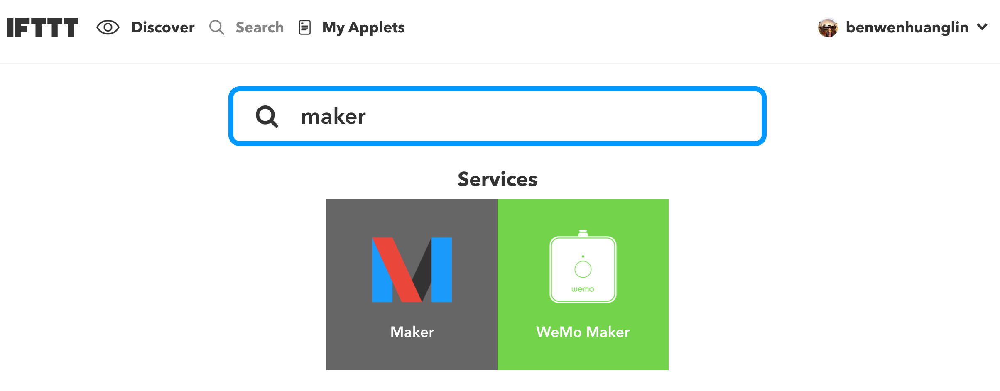
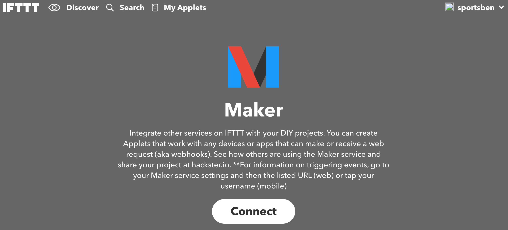
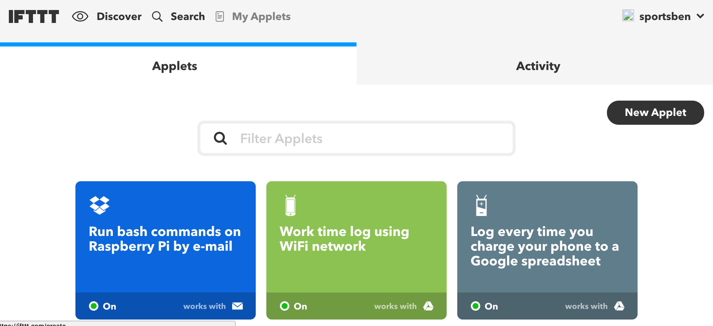
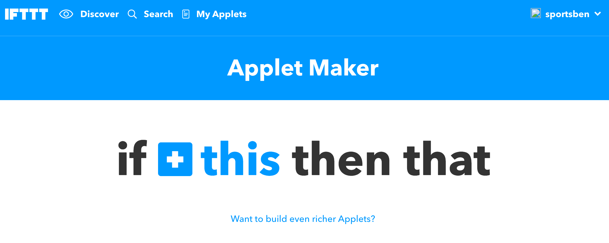

# ESP8266 To IFTTT Using Arduino IDE

The following instructions demostrates how to send the Notification to slack channel if the humidity is too high.

Wemos creates a WiFi client and sends a URL request to IFTTT server to enable slack channel notification service.

##IFTT Maker channel configuration

1. Create an IFTTT account.

2. Enable Maker channel. 
 
 Now we are using this Maker channel which we can our own DIY project by simplying receiving or sending a web request.
 



3. Create our own IFTTT service. Go to My Applets -> New Applet.

4. IF something happens

5. Then that...


##Send an url request from Wemos

1. Using the example code. And don't forget to change the WIFI credential part.
```
const char *ssid     = "XXXX";
const char *password = "XXXX";

```


2. Change your own private key and customized triggered event name.
```
const char *privateKey = "mGHBR8ACguChSfwY38WHLBj46ercITqKMlFhacszvOx";
```
```
send_event("wemos_demo");
```

